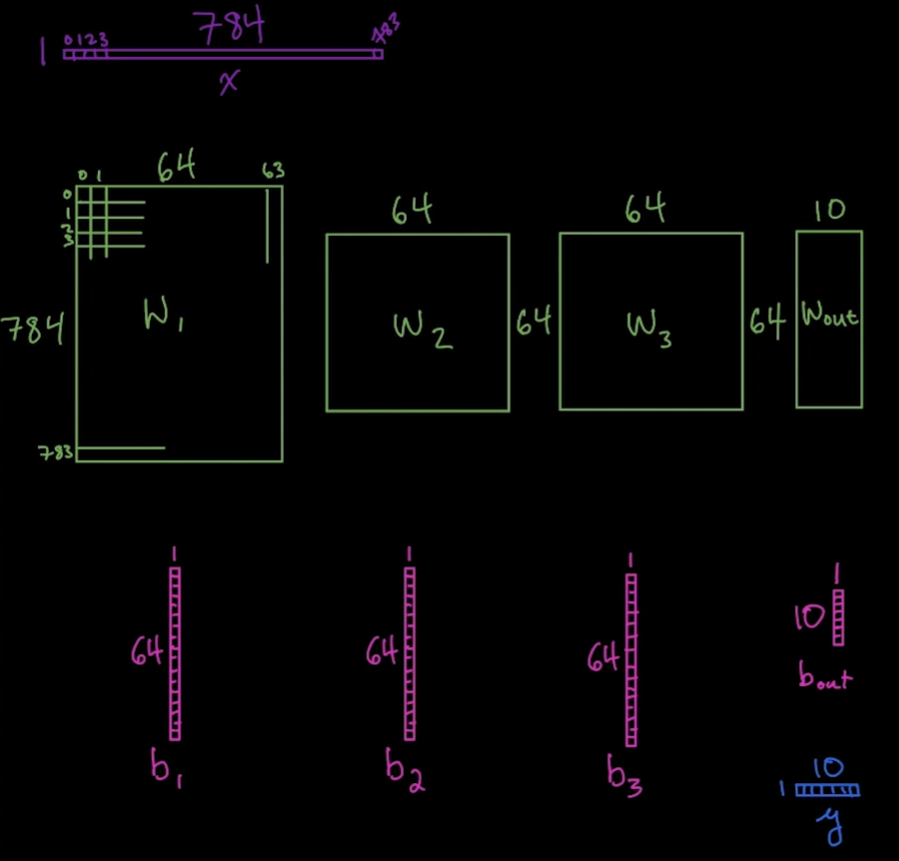

## 선형대수

- 어떤 식에 지수나 루트 제곱근 형태가 있다면 비선형 변환이다.
- **연립 일차방정식을 미지수로 풀어내는 것**이다.

---

## 예시 1 : 다항 방정식 내 x와 같은 미지수를 동시에 풀어내는 선형방정식 계 다중 선형식

- 어떤 보안관리 시속 180km로 달리는 차를 가지고 있다.
- 은행 강도는 150km로 달리는 차를 가지고 있고 보안관보다 5분 일찍 출발했다.
- 이 떄 보안관이 강도를 따라잡는데 얼마의 시간이 소요될까?
- 보안관이 강도를 잡은 위치가 출발점으로부터 거리는 얼마일까? (가속도,교통 등 조건은 무시, 직선 거리 주행 가정)

<br>

강도의 분당 이동거리 = 2.5 -> d = 2.5t

보안관의 분당 이동거리 = 3 -> d = 3(t-5)

1. 2.5t = 3(t-5)
2. 2.5t = 3t - 15
3. 2.5t - 3t = -15
4. -0.5t = -15
5. t = -15 / -0.5 = 30 min

**선형대수학의 옵션 중에는 위 예시처럼 해를 1개 가지는 선형방정식이 있고, 해가 없거나, 해가 무한대인 3가지 옵션만이 있습니다.**

---
## 예시 2 : 선형 회귀 모델을 이용한 집값 예측

집값 y가 있고, 그 집값을 예측하기 위한 여러가지 특징/변수가 있고, 관련 특징이 많을수록 예측값이 더 정확해진다.

관련 특징이랑 학교와의 거리, 역세권, 방 개수 등등 여러가지가 있을 것이다.

이 특징 중 a라는 y 절편의 변수가 있고 이 변수는 가능한 집값 중 한 점을 지나는 변수이다. (집값의 평균)

이 y의 절편인 a(평균 기준치)가 없다면 정확히 일치하는 모델을 만들기가 훨씬 어렵게 된다.

<br>

위 글을 토대로 한 임의의 식

- **y = a + lx + cx2 + mx + nx + ...**

<br>

위 식들을 이용한 머신러닝 문제의 일반적 형태의 회귀모델

- 각각 다른 집을 나타내는 수천개의 행이 있고 여기에 n개의 행이 있고, 수십개의 특성을 포함할 수 있다.

| y =    | a + lx + cx2 + mx + nx + ...        |
| ------ | ----------------------------------- |
| y1 =   | a + lx1.1 + cx1.2 + mx1 + nx1,m ... |
| y2 =   | a + lx2.1 + cx2.2 + mx2 + nx2,m ... |
| yn ... | ...                                 |

---
## 예시 3 - 딥러닝 머신 비전 모델

- 이 모델에서는 한 이미지당 784픽셀로 된 벡터를 입력 신호(x)로 가지고, 이 벡터를 이용해 결과값(y)을 예측한다.
- 중간에는 weight 행렬과 bias 벡터가 존재한다.

<br>



<br>

> **Design Neural Network Architecture**

```python
def network(x, weights, biases):
    
    # two dense hidden layers: 
    dense_1 = dense(x, weights['W1'], biases['b1'])
    dense_2 = dense(dense_1, weights['W2'], biases['b2'])
    dense_3 = dense(dense_2, weights['W3'], biases['b3'])
    
    # linear output layer (softmax)
    out_layer_z = tf.add(tf.matmul(dense_3, weights['W_out']), biases['b_out'])
    
    return out_layer_z
```

<br>

> **Define Dictionaries for storing weights and biases for each layer -- and initialize**

- b1에서부터 b_out 까지의 벡터 형성
- 특정 형태를 가진 w1에서 w_out까지의 행렬

```python
bias_dict = {
    'b1': tf.Variable(tf.zeros([n_dense_1])), 
    'b2': tf.Variable(tf.zeros([n_dense_2])),
    'b3': tf.Variable(tf.zeros([n_dense_3])),
    'b_out': tf.Variable(tf.zeros([n_classes]))
}

weight_dict = {
    'W1': tf.get_variable('W1', [n_input, n_dense_1], initializer=weight_initializer),
    'W2': tf.get_variable('W2', [n_dense_1, n_dense_2], initializer=weight_initializer),
    'W3': tf.get_variable('W3', [n_dense_3, n_dense_3], initializer=weight_initializer),
    'W_out': tf.get_variable('W_out', [n_dense_3, n_classes], initializer=weight_initializer)
}
```

<br>

지금은 위 모델의 세세한 부분에 집중하는 것이 아닌, 다양한 매개변수를 어떻게 이용하는지 보여주는 예시이다.

그 매개변수로 weights와 bias가 쓰인 것이고, 이들을 머신러닝 알고리즘으로 해석해내는 일련의 작업이다.

위 과정에서 몇몇 특정 픽셀 입력값이 표현하는 바와 어떤 특정 결과값을 가지는지 예측할 수 있도록 매핑할 수 있게 된다.

위 같은 방식은 더 높은 차원의 객체, 고차원 텐서에 대해서도 동일하게 적용할 수 있다.

이러한 다차원을 대상으로 하는 머신 비전 모델은 합성곱 신경망과 같은 모형의 구축을 가능하게 한다.